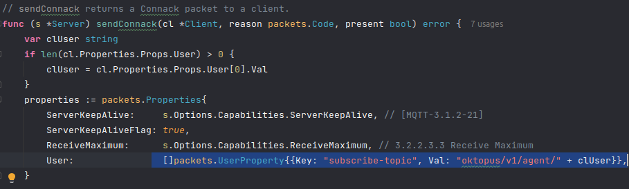

This broker is an implementation of mochi. I've to forked it to customize CONNACK packet userProperty, although  mochi lib might have a better approach to do it.

To run this project you might have Go compiler in your machine, and inside cmd folder there is a run.sh script, which runs the project with the right arguments; also inside the same folder is the auth.json file, that carries configs of RBAC.

